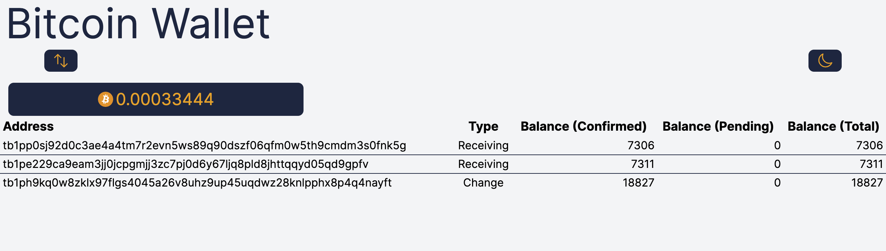
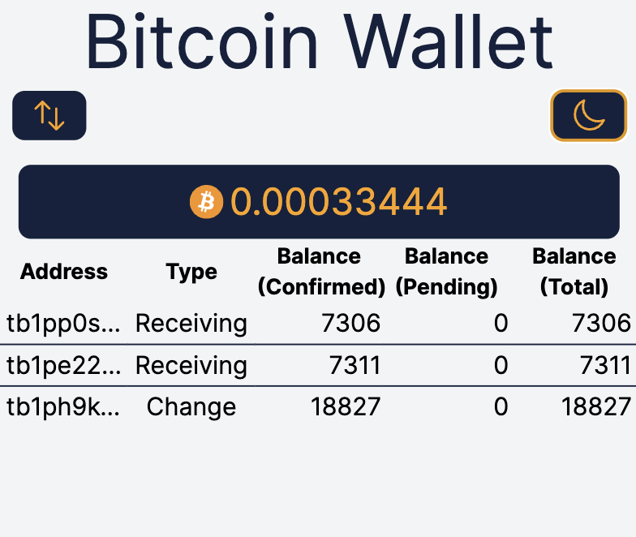
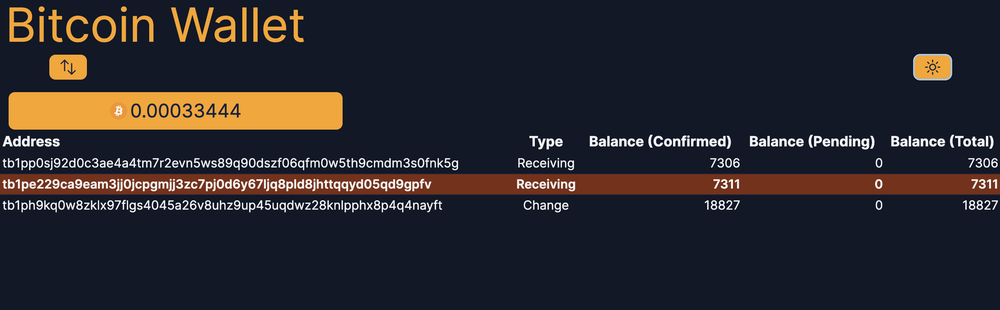
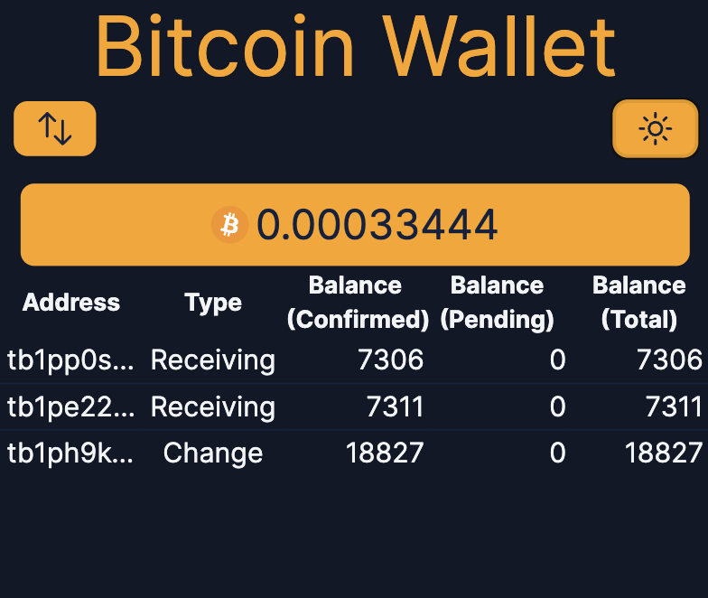

# React.js Bitcoin Wallet

[](https://opensource.org/licenses/MIT)

| :warning: WARNING                                             |
| :------------------------------------------------------------ |
| Do not use this wallet! It is for portfolio/learning purposes |

This is a [Next.js](https://nextjs.org/) project bootstrapped with
[`create-next-app`](https://github.com/vercel/next.js/tree/canary/packages/create-next-app).
It is a Bitcoin wallet that uses [`mempool.space`](https://mempool.space/)
[Esplora](https://github.com/Blockstream/esplora/blob/master/API.md) API.

See it in action at [`vercel.app`](https://react-wallet-with-lasers.vercel.app/).

## Screenshots

| Desktop                                                                   | mobile                                                                  |
| ------------------------------------------------------------------------- | ----------------------------------------------------------------------- |
|  |  |
|    |    |

## Scope

Libraries used:

- [React.js](https://react.dev/) and [Next.js](https://nextjs.org/) for the
  frontend and async functionality.
- [Tailwind CSS](https://tailwindcss.com/) for styling.
- [BitcoinJS](https://github.com/bitcoinjs) for Bitcoin
  functionality.

Functionality:

- Create a wallet from a network type (mainnet/testnet) and a mnemonic phrase.
- Taproot addresses and descriptors by default.
- Fetch the wallet's balance asynchronously from the Esplora API.

Purpose:

- Get acquainted with TypeScript.
- Learn how to build apps with React.js and Next.js.
- Learn how to fetch data asynchronously with Next.js
  and do server-side rendering with async components.
- Improve my tailwind CSS skills.
- Tap into my Bitcoin knowledge and learn how to use BitcoinJS.
- Use my knowledge of CI/CD with GitHub Actions to deploy the app to Vercel.

## How it works

The wallet is a single page application that has server-side rendering
on the transactions async API fetch from Esplora.
This is done by BitcoinJS.

Once the wallet is created, the app will fetch the wallet's balance
from the API and display them.
This is done with the new (version 13) [Next.js support for promises inside components](https://nextjs.org/blog/next-13#data-fetching).
It uses the Esplora API which is hard-coded to use the `mempool.space` API.
The balance is shown and addresses are listed in a table.

There is a "Sync" button that will reset the cached-data from
the Esplora API and fetch the latest wallet balance.

## Getting Started

First, install the dependencies:

```bash
npm install
# or
yarn install
# or
pnpm install
```

Then, run the development server:

```bash
npm run dev
# or
yarn dev
# or
pnpm dev
```

Open [http://localhost:3000](http://localhost:3000) with your browser to see the app.
